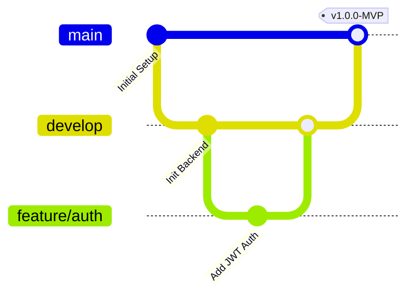
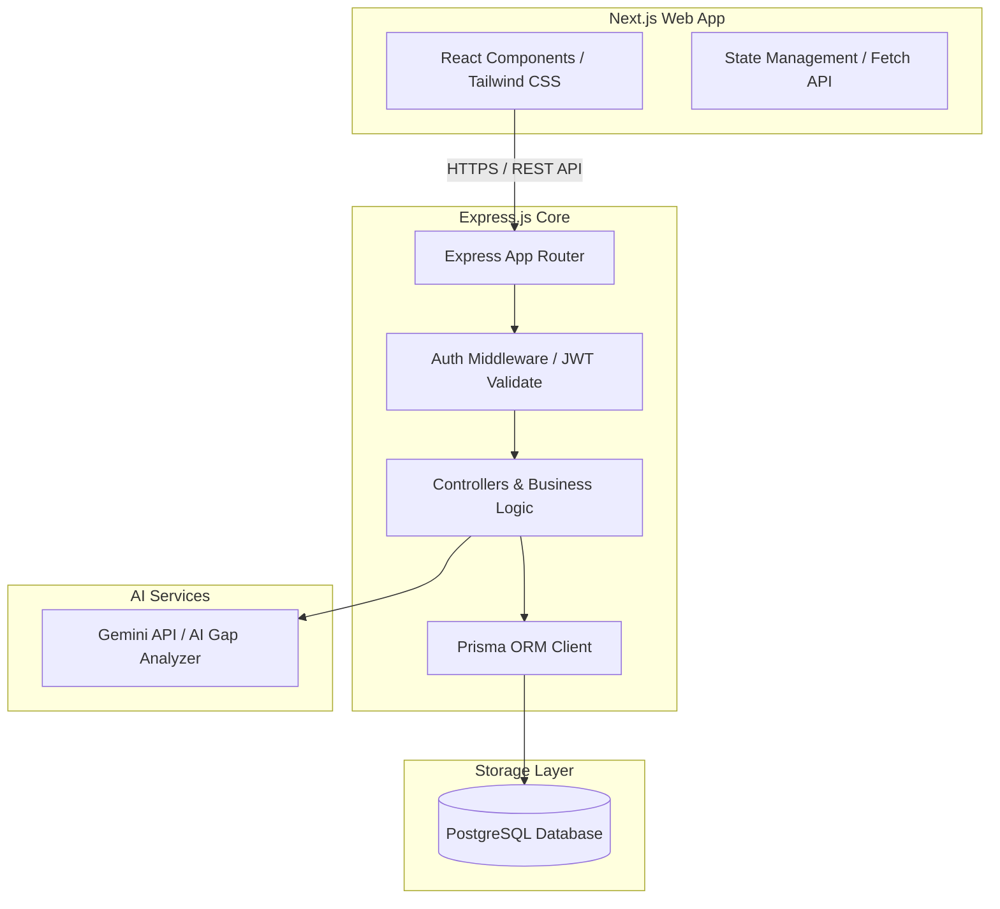

# Product Requirements Document (PRD)
## Project: Internship & Placement Intelligence Platform

---

### 1. Document Control & Vision
* **Author**: Senior Software Engineer & Product Manager
* **Status**: Draft
* **Target Audience**: 3rd-Year CS Students, Placement Officers, Interviewers
* **Product Vision**: To transform the chaotic, spreadsheet-driven internship and placement preparation process into an engineering-led, data-driven, and structured journey. The platform acts as a personal CRM (Customer Relationship Management) for careers, coupled with an AI-driven skill diagnostic tool to guarantee employment readiness.

---

### 2. Product Objectives & Value Proposition
Students face three major challenges during the placement season:
1. **Application Tracking Chaos**: Managing dozens of applications across different platforms (LinkedIn, Internshala, company portals) with varying deadlines, online assessments (OAs), and interview schedules.
2. **Skill Mismatch**: Lack of clarity on whether their resume matches a specific Job Description (JD) and which skills they need to acquire.
3. **Lack of Performance Analytics**: Inability to see application success rates, identify bottlenecks (e.g., getting filtered at OA vs. HR round), and trace trends over time.

**Value Proposition**:
A unified dashboard that tracks the placement lifecycle, analyzes resumes against job descriptions to provide personalized learning roadmaps, and presents actionable preparation metrics.

---

### 3. User Personas & Roles
We will support two core roles utilizing **Role-Based Access Control (RBAC)**:

#### Student (Primary User)
* **Goal**: Track applications, upload resumes, analyze skill gaps, and view personal performance analytics.
* **Pain Points**: Forgets deadlines, doesn't know why resumes get rejected, lacks preparation direction.

#### Admin / Placement Officer (Future / Extended Scope)
* **Goal**: Monitor aggregate placement performance of the batch, identify top-performing domains, and spot students needing help.
* **Pain Points**: Lacks real-time data on how many students have secured offers or are currently in interview rounds.

---

### 4. Core Module Specifications

#### Module 1: Application Tracker
A CRM-style tracker specifically tailored for the placement process.

* **F1.1: Application Management (CRUD)**
  * Fields: Company Name, Role/Designation, Job Description URL, Application Link, Salary/Stipend (CTC), Location, Application Date, Deadline, Domain (Software Engineering, DevOps, Product, Data Analyst).
* **F1.2: Status Pipeline Tracking**
  * Statuses: `APPLIED`, `OA_SCHEDULED`, `OA_COMPLETED`, `INTERVIEWING`, `OFFER`, `REJECTED`, `WITHDRAWN`.
* **F1.3: Interview Round Tracking**
  * Ability to add multiple sequential interview rounds per application (e.g., Technical Round 1, System Design, HR Round).
  * Fields: Round Name, Scheduled Date, Interviewer Name, Notes/Questions asked, Rating (1-5 scale).
* **F1.4: Deadlines & Notifications**
  * Visual indicators for upcoming deadlines and scheduled interviews.

#### Module 2: Resume ↔ JD Skill Gap Analyzer
An AI-powered tool to align preparation with market demand.

* **F2.1: Resume Upload & Parsing**
  * Support PDF file uploads. The backend extracts text from the PDF.
* **F2.2: Job Description Input**
  * A text area for pasting job descriptions.
* **F2.3: AI-Driven Analysis (Gemini LLM API)**
  * Parse resume and JD to extract skills.
  * Compare extracted skills to identify **matched skills** and **missing skills**.
  * Compute an **ATS-like Match Score (0 - 100)** based on semantic similarity and keyword presence.
* **F2.4: Personalized Learning Roadmap**
  * Generate a targeted list of topics and resources to learn the missing skills.
* **F2.5: Report Generation**
  * Export the gap analysis as a readable markdown or PDF report.

#### Module 3: Analytics Dashboard
Data visualization for tracking preparation and success rates.

* **F3.1: Funnel Analytics**
  * Total Applications → OAs Cleared → Interviews Attended → Offers Secured.
* **F3.2: Conversion Rates**
  * OA-to-Interview conversion rate.
  * Interview-to-Offer conversion rate.
* **F3.3: Domain & Trend Charts**
  * Breakdown of applications by domain (DevOps vs. SWE vs. PM).
  * Monthly/weekly application trends (bar/line chart).
* **F3.4: Skill Readiness Score**
  * Average ATS score across analyzed resumes/JDs.

---

### 5. Git & GitHub Workflow Rules
To ensure collaboration mirrors a professional startup environment, we will enforce the following git conventions:

#### A. Branching Strategy: GitFlow-Lite
We will use a branch structure that separates production code from active development:
* `main`: Represents production-ready code. No direct commits allowed.
* `develop`: Integration branch where all feature branches merge.
* `feature/<feature-name>`: Active development branches (e.g., `feature/auth-setup`, `feature/tracker-api`). Created off `develop`.
* `bugfix/<bug-name>`: Bug fixes created off `develop`.
* `hotfix/<fix-name>`: Critical production fixes created off `main` and merged to both `main` and `develop`.

#### B. Commit Message Conventions (Conventional Commits)
Commit messages must follow this structure:
`<type>(<scope>): <short summary>`

* **Types**:
  * `feat`: A new feature
  * `fix`: A bug fix
  * `docs`: Documentation changes only
  * `style`: Styling changes (formatting, missing semi-colons, etc.)
  * `refactor`: Code change that neither fixes a bug nor adds a feature
  * `test`: Adding missing tests or correcting existing tests
  * `chore`: Updating build tasks, package manager configs, etc.
* **Examples**:
  * `feat(auth): implement jwt token generation and validation`
  * `fix(tracker): correct date conversion in application create API`
  * `docs(readme): update environment variable setup instructions`

#### C. Pull Request (PR) Guidelines
* Every PR must target the `develop` branch (never merge directly into `main` unless release deployment).
* PRs must include a brief description of what was changed and how it was tested.
* A peer review is required before merging.

---

### 6. System Architecture & Tech Stack Details

* **Frontend**: Next.js (App Router), React, Tailwind CSS, Axios/Fetch.
* **Backend**: Node.js, Express.js, Prisma ORM, JSON Web Token (JWT), Bcrypt, Zod.
* **Database**: PostgreSQL (relational model for strict structured data integrity).
* **Cloud & DevOps**: Docker, GitHub Actions (CI/CD), AWS EC2 (Hosting), AWS S3 (Resume storage), AWS RDS (PostgreSQL).

---

### 7. Non-Functional Requirements (NFRs)
1. **Security**: Password hashing using `bcrypt` (10-12 salt rounds), HTTPS communications, secure HTTP-only cookies/secure headers via `helmet`.
2. **Performance**: Query response times under 200ms for tracking tables. Use proper indexes on foreign keys.
3. **Scalability**: Stateless backend design allowing horizontal scaling behind a load balancer.

---

### 8. Phase Roadmap
* **Phase 1**: Product Requirements Document (PRD) & Workflow setup (Current)
* **Phase 2**: User Stories & Use Case Mapping
* **Phase 3**: Database Design (Schema creation, ERD, migration scripting)
* **Phase 4**: System Design (Architecture diagram, scalability review)
* **Phase 5**: Backend Development (APIs, Authentication, Core modules)
* **Phase 6**: Frontend Development (UI/UX, Dashboards, APIs integration)
* **Phase 7**: Testing (Unit, Integration & API testing)
* **Phase 8**: Dockerization (Containerizing frontend, backend, DB)
* **Phase 9**: AWS Deployment (EC2, S3, RDS manual setup)
* **Phase 10**: CI/CD (GitHub Actions workflow automation)
* **Phase 11**: Resume Optimization & Interview Prep
