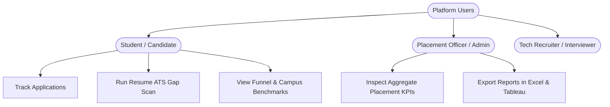

# Product Requirements Document (PRD)
## Project: Internship & Placement Intelligence Platform
**Document Version:** 2.0.0  
**Status:** Approved / In Progress  
**Author:** Senior Software Engineer, Product Manager & Student Engineer  
**Target Audience:** Engineering Students, Placement Officers, Tech Recruiters, System Design Interviewers  

---

## 1. Executive Summary & Product Vision

### 1.1 The Problem
During college internship and placement seasons, undergraduate engineering students experience extreme cognitive overload and operational chaos:
1. **Spreadsheet Chaos:** Students apply to 50–150+ companies across LinkedIn, Unstop, company portals, and referral networks, losing track of deadlines, test links, and interview rounds.
2. **The "Resume Black Hole":** 75%+ of applicants are screened out at the initial Applicant Tracking System (ATS) stage because their resumes lack targeted keywords and domain skills matching specific Job Descriptions (JDs).
3. **Data Blindness:** Students lack feedback loops. They do not know their bottleneck (e.g., failing at OA vs. Technical Round 1 vs. HR), nor do they understand broader campus placement trends, compensation distributions, or the quantifiable benefit of internships.

### 1.2 The Solution & Value Proposition
The **Internship & Placement Intelligence Platform** is an enterprise-grade career operating system designed to turn chaotic job hunting into a structured, data-driven engineering journey:
* **Personal CRM:** Tracks applications, multi-round interview stages, assessment links, and deadlines.
* **AI Skill Diagnostic Engine:** Extracts text from student resumes (PDF), compares them against target JDs using LLM/Gemini semantic analysis, computes an ATS readiness score (0–100), and outputs personalized learning roadmaps.
* **Personal Analytics Dashboard:** Visualizes the applicant's conversion funnel, OA clearance rate, and domain preparation progress.
* **Campus Placement & Internship Intelligence:** Aggregates real-world placement records to provide macroeconomic campus benchmarks: department placement rates, package percentiles, recruiter hiring volumes, and the statistical impact of prior internship experience.

---

## 2. User Personas & Roles

### 2.1 Persona 1: Aditya Sharma (3rd-Year CS Student)
* **Demographics:** Pre-final year undergraduate preparing for Summer 2027 SDE and Cloud internships.
* **Behaviors:** Actively applies to 10+ jobs per week, practices LeetCode daily, frequently tweaks resume.
* **Pain Points:** Misses OA test links buried in email; doesn't know if his resume has the exact skills required for DevOps vs. Full Stack roles; anxious about market salaries and campus conversion benchmarks.
* **Primary Jobs-to-be-Done (JTBD):** Single view of all pending interviews + automated resume feedback against target JDs before applying.

### 2.2 Persona 2: Dr. Meenakshi Sundaram (University Placement Coordinator)
* **Demographics:** Head of Training & Placement Cell managing 800+ graduating students.
* **Pain Points:** Dependent on manual Google Forms; unable to answer leadership queries like *"Which department has the lowest placement conversion?"* or *"What is the median CTC increase for students with prior internships?"*.
* **Primary JTBD:** Executive reporting, automated SQL aggregations, Tableau workbook exports, and Excel spreadsheets for institutional leadership.

---

## 3. Core Functional Module Specifications

### Module 1: Application Tracker (Candidate CRM)
* **1.1 Application Ingestion & Lifecycle Management (CRUD)**
  * Fields: `Company Name`, `Role/Designation`, `Domain` (SWE, DevOps, Data, Product, QA), `Application URL`, `Job Description URL`, `Salary/Stipend (LPA/INR)`, `Location`, `Application Date`, `Deadline`, `Notes`.
* **1.2 Pipeline Status Workflow**
  * State Machine: `APPLIED` &rarr; `OA_SCHEDULED` &rarr; `OA_COMPLETED` &rarr; `INTERVIEWING` &rarr; `OFFER` / `REJECTED` / `WITHDRAWN`.
* **1.3 Multi-Round Interview Tracker**
  * One-to-many relationship (`Application` &rarr; `InterviewRounds`).
  * Fields per round: `Round Name` (e.g. Technical 1, System Design, Managerial, HR), `Scheduled Date`, `Interviewer Name`, `Questions Asked`, `Preparation Notes`, `Confidence Rating (1-5)`.
* **1.4 Deadline & Action Alerts**
  * Visual badges indicating impending assessment deadlines (Overdue, Due Today, Due this Week).

---

### Module 2: AI-Powered Resume ↔ JD Skill Gap Analyzer
* **2.1 Resume Ingestion & Extraction**
  * Secure PDF upload (Max 5MB) via AWS S3 / local multipart storage.
  * Backend text extraction utilizing `pdf-parse` with memory stream isolation.
* **2.2 Job Description Input**
  * Raw text paste area with clean formatting and character validation (min 100 chars, max 10,000 chars).
* **2.3 Semantic Skill Comparison & Scoring Engine**
  * Leverages Google Gemini LLM API with structured JSON output prompts.
  * Extracts hard skills, cloud tools, frameworks, and system design competencies.
  * Computes an **ATS Match Score (0–100)**:
    $$\text{Score} = w_1 \cdot \text{Keyword Match} + w_2 \cdot \text{Experience Alignment} + w_3 \cdot \text{Tooling Overlap}$$
  * Outputs:
    * **Matched Skills:** Green badges indicating strong alignment.
    * **Missing Skills:** Red warning badges highlighting skill gaps.
    * **Personalized Learning Roadmap:** Structured 3-step action items with documentation and course recommendations.
* **2.4 Report Export**
  * Downloadable gap analysis summary for offline preparation.

---

### Module 3: Personal Application Analytics Dashboard
* **3.1 Conversion Funnel Analytics**
  * Funnel stages: Submitted &rarr; OA Scheduled &rarr; Interviewed &rarr; Offers.
  * Calculates drop-off percentages between each recruitment milestone.
* **3.2 Personal Performance Ratios**
  * Success Rate: `(Offers / Total Applications) * 100`
  * OA-to-Interview Conversion: `((Interviews + Offers) / Total Applications) * 100`
  * Rejection Rate: `(Rejections / Total Applications) * 100`
* **3.3 Domain & Monthly Timeline Breakdown**
  * Distribution of applications across domains (SWE vs. DevOps vs. Data).
  * Monthly submission trajectory to maintain consistency.

---

### Module 4: Campus Placement & Internship Intelligence Dashboard
*(Integrated Institutional Intelligence)*
* **4.1 Real-World Benchmark Dataset**
  * Standardized cohort of 800+ student records with 14 attributes: `Student_ID`, `Department`, `Graduation_Year`, `CGPA`, `Internship`, `Internship_Company`, `Internship_Stipend`, `Placement_Status`, `Company`, `Job_Role`, `Salary_LPA`, `Location`, `Skills`, `Placement_Date`.
* **4.2 Executive KPI Strip**
  1. **Total Students Enrolled:** Live cohort count.
  2. **Campus Placement Rate (%):** Placed students divided by total cohort.
  3. **Average Salary Package (LPA):** Mean CTC of placed students.
  4. **Highest Salary Package (LPA):** Peak campus offer.
  5. **Student Internship Rate (%):** Percentage of students with prior industrial experience.
* **4.3 7 Core Interactive Visualizations**
  1. *Placement Rate by Department:* Bar chart benchmark across CSE, IT, ECE, Mechanical, and Civil.
  2. *Average Salary by Department:* Comparative compensation across branches.
  3. *Placement Trend by Graduation Year:* Multi-year progression (2023–2026).
  4. *Top Hiring Companies:* Horizontal bar chart ranking recruiter volume (TCS, Accenture, Deloitte, Amazon, etc.).
  5. *Job Roles Distribution:* Headcount across SWE, Full Stack, Data Analyst, Cloud Associate, DevOps.
  6. *Internship vs. Placement Rate:* Quantifies the statistical advantage (+34.2% higher placement probability) for students with internships.
  7. *Salary Distribution:* Histogram categorized into Standard (<6 LPA), Core (6–10 LPA), Dream (10–18 LPA), and Super Dream (18+ LPA).
* **4.4 Multi-Dimensional Quick Filters**
  * Real-time reactive filtering by `Department`, `Graduation Year`, `Placement Status`, `Internship Status`, and `Job Role`.
* **4.5 Multi-Tool Deliverables Suite**
  * Native exports for **SQL** (`data_cleaning.sql`, `analysis_queries.sql`), **Java 17 Streams Engine** (`PlacementAnalytics.java`), **Python/Pandas** (`placement_analysis.ipynb`), **Tableau** (`placement_dashboard.twb`), and **Excel** (`placement_report.xlsx`).

---

## 4. Non-Functional Requirements (NFRs)

| Category | Specification | Implementation Strategy |
| :--- | :--- | :--- |
| **Response Latency** | P95 API Latency < 200ms; Dashboard load < 1.0s | Indexed MongoDB keys; MySQL query optimizations; static page optimization |
| **Security & Auth** | Stateless JWT authentication (RS256/HS256) | Passwords hashed with bcrypt (salt rounds 10); HTTP-only tokens / Bearer headers |
| **Data Integrity** | Structured schema validation & ACID transactions | Mongoose document validation; MySQL constraints; relational analytics staging |
| **Scalability** | Designed for 1,000 &rarr; 100,000 students | Stateless backend pods; horizontal read-replicas; S3 offloading for blobs |
| **Reliability** | 99.9% uptime during placement season | Containerized with Docker; automated health checks; graceful degradation |
| **Portability** | Multi-environment deployment | Runs identically on Localhost, Docker Compose, AWS EC2, and Render/Vercel |

---

## 5. Git & GitHub Engineering Standards

To ensure your GitHub repository stands out to senior engineering recruiters, all development adheres to standard enterprise conventions:

### 5.1 Branching Model: GitFlow-Lite
* `main`: Protected. Represents clean, production-ready code. Commits require passing CI checks.
* `develop`: Integration branch. Active development merges here.
* `feature/<feature-name>`: Scoped feature branch (e.g. `feature/application-tracker-crud`, `feature/tableau-export`).
* `bugfix/<issue-name>`: Bug fixes branched off `develop`.
* `hotfix/<fix-name>`: Urgent production fixes branched directly off `main`.

### 5.2 Conventional Commits Specification
Commits must follow the standard syntax: `<type>(<scope>): <subject>`
* `feat`: A new feature for the user (e.g. `feat(analytics): add campus intelligence interactive charts`)
* `fix`: A bug fix (e.g. `fix(auth): handle expired jwt redirect in middleware`)
* `docs`: Documentation updates (e.g. `docs(prd): add Phase 1 Product Requirements Document`)
* `refactor`: Code change that neither fixes a bug nor adds a feature (e.g. `refactor(db): optimize application repository queries`)
* `test`: Adding missing tests or correcting existing tests (e.g. `test(api): add unit tests for application validator`)

---

## 6. Technical Interview Questions & Concepts (Phase 1 Focus)

As a candidate discussing this project in interviews, you will be tested on your **Product Thinking** and **System Architecture Decisions**:

> **Q1: Why did you decide to build both an Application Tracker and an AI Skill Gap Analyzer in the same platform?**  
> *Interview Answer:* "In product discovery, we observed that tracking applications and preparing resumes are not separate workflows—they form a continuous loop. Students apply, get rejected, and have no visibility into *why*. By coupling tracking with diagnostic skill gap analysis, our platform transforms passive application logging into active preparation feedback. When an applicant pastes a target JD, they identify missing keywords before submission, directly improving their interview conversion rate."

> **Q2: Why separate the Personal Analytics Dashboard from the Campus Placement Intelligence Dashboard?**  
> *Interview Answer:* "This represents a separation of micro-concerns vs. macro-concerns. The Personal Dashboard is transactional, private, and user-centric (tracking individual funnel conversion from Applied &rarr; OA &rarr; Interview &rarr; Offer). The Campus Intelligence Dashboard is aggregative, institutional, and analytical (processing 800+ cohort records across departments, salary percentiles, and recruiter hiring volumes). Combining both gives the candidate individual clarity and macroeconomic market context."

> **Q3: What architecture trade-offs did you evaluate when choosing MongoDB for application data and MySQL for analytics?**  
> *Interview Answer:* "We implemented a two-database separation: MongoDB + Mongoose provides schema flexibility and natural document nesting for unstructured Gemini AI outputs and application tracking with embedded interview rounds. MySQL + SQL provides relational rigor and standard SQL window functions for institutional cohort analytics, preventing heavy analytical aggregations from impacting operational transactional performance."

---

## 7. Next Steps & Phase Progression

Following Phase 1 approval, the engineering workflow advances to:
* **Phase 2:** User Stories & Detailed Scenario Mapping (`docs/USER_STORIES.md`)
* **Phase 3:** Database Design & Normalization Deep-Dive (`docs/database.md`)
* **Phase 4:** High-Level & Low-Level System Design (`docs/architecture.md`)
* **Phase 5 & 6:** Backend & Frontend Production Development
