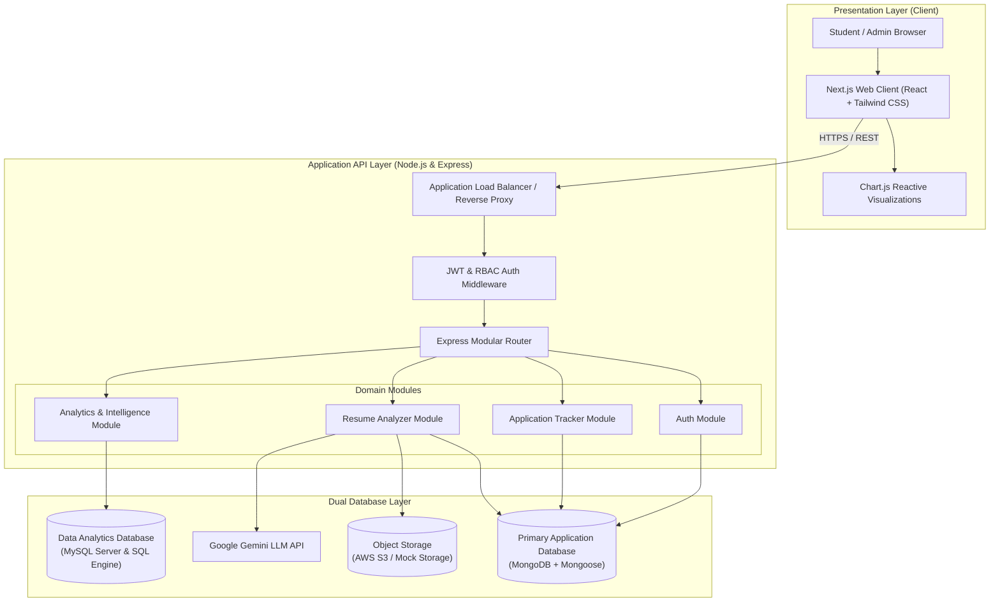
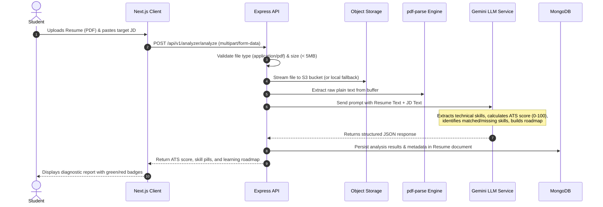

# System Architecture & Technical Specifications

This document outlines the architectural patterns, data flow mechanisms, component modularity, and scaling strategies for the **Internship & Placement Intelligence Platform**.

---

## 1. High-Level Architecture Overview

The system follows an enterprise **decoupled, two-database architecture** designed for high throughput, operational scalability, and clean separation of concerns between operational transactional workloads and institutional analytical workloads:

```text
                    Internship & Placement Platform
                              │
                 ┌────────────┴────────────┐
                 │                         │
          Full-Stack Application      Data Analytics
                 │                         │
             MongoDB                     MySQL
                 │                         │
        React + Node.js             SQL + Python
        Express + JWT               Excel + Tableau
        Gemini API
```



---

## 2. Core Subsystems & Data Flows

### 2.1 Subsystem 1: Application Tracker Flow (MongoDB)
1. **Request Ingestion:** Client submits an application payload (`POST /api/v1/applications`).
2. **Validation:** `application.validator.js` validates payload using `zod`.
3. **Authentication Context:** `auth.middleware.js` verifies the Bearer JWT, extracts `req.user.id`, and attaches it to the request.
4. **Data Handling:** `application.service.js` invokes `application.repository.js` using Mongoose models. Applications embed interview round subdocuments for fast atomic retrieval.
5. **Response:** Returns `201 Created` with formatted application and round objects.

### 2.2 Subsystem 2: Resume ↔ JD Skill Gap Analysis Flow


### 2.3 Subsystem 3: Campus Placement Intelligence Flow (MySQL)
1. **Raw Ingestion & SQL Cleansing:** 825 raw records loaded into MySQL `raw_placement_records` and transformed into 800 deduplicated records in `placement_records` via `data_cleaning.sql` (`ROW_NUMBER()` and `CASE WHEN`).
2. **Serving Analytics:**
   * *Client-Side Reactive Visualizations:* Pre-processed dataset loaded in Chart.js enabling sub-millisecond dynamic filtering on Department, Year, Status, Internship, and Role.
   * *Server-Side SQL Queries:* `GET /api/v1/analytics/intelligence` executes queries directly on MySQL `placement_records` via `mysql2`.
3. **Multi-Artifact Export:** Endpoints and file downloads serve dynamic `.xlsx` reports, `.twb` Tableau workbooks, and pure Java 17 Streams outputs.

---

## 3. Modular Backend Architecture (Clean Code Pattern)

The Express backend follows a **Decoupled Layered Architecture**:

```text
HTTP Request
     │
     ▼
[routes] ────────── URL mapping & middleware attachment (Auth, RateLimiter)
     │
     ▼
[validators] ────── Schema validation (Zod) preventing corrupt inputs
     │
     ▼
[controllers] ───── Extracts req.body/params, manages HTTP status codes (200, 201, 400, 500)
     │
     ▼
[services] ──────── Pure business logic, algorithms, scoring, third-party orchestration
     │
     ▼
[repositories] ──── Mongoose queries (operational) / MySQL queries (analytical)
     │
     ▼
Databases (MongoDB & MySQL)
```

*Why this pattern matters in interviews:*  
It enforces the **Single Responsibility Principle (SRP)** and **Dependency Inversion**. Services can be unit-tested without mocking HTTP objects (`req`, `res`), and database drivers can be swapped without touching business logic.

---

## 4. Architectural Trade-Off Analysis

| Decision | Chosen Approach | Alternative Considered | Engineering Rationale |
| :--- | :--- | :--- | :--- |
| **Two-Database Architecture** | MongoDB (App) + MySQL (Analytics) | Single monolithic database | MongoDB provides document flexibility for varied resume JSON outputs, application logs, and student profiles. MySQL provides relational rigor and SQL standard window functions for institutional cohort analytics. |
| **Monolith vs. Microservices** | Modular Monolith | Microservices | A modular monolith provides clean domain separation without the operational complexity of distributed tracing, network latency, and multi-repo overhead. |
| **File Storage** | AWS S3 / Object Store | Database BLOBs | Storing PDF binary blobs in database documents causes severe database bloat, degrades backup speeds, and wastes memory buffers. |
| **LLM Orchestration** | Direct Gemini API with deterministic fallback | Self-hosted open-source model | Cloud LLM API provides high-quality extraction with zero GPU infrastructure maintenance costs, while our mock engine ensures offline reliability. |

---

## 5. System Design Interview Questions

> **Q1: Why separate the application database (MongoDB) from the analytics database (MySQL)?**  
> *Interview Answer:* "Separating operational (OLTP) and analytical (OLAP) workloads is an industry-standard architectural best practice:
> 1. **Workload Isolation:** Analytical queries involving complex aggregations, window functions, and full-table scans consume substantial CPU and memory. Running them on MySQL prevents degrading write-heavy student login, application tracking, and resume upload performance on MongoDB.
> 2. **Data Model Fit:** Student applications and AI resume roadmap steps are naturally hierarchical and nested, mapping cleanly to MongoDB documents. Cohort placement benchmarks (rates, average CTCs, rankings) require relational grouping and tabular queries best suited for MySQL."

> **Q2: How do you handle database connection pooling in Node.js for MongoDB and MySQL?**  
> *Interview Answer:* "Mongoose automatically manages a built-in connection pool to MongoDB, reusing open sockets across concurrent requests. For MySQL, we initialize `mysql2/promise` with `createPool({ connectionLimit: 10 })`. This multiplexes queries across a pool of persistent connections without opening and tearing down TCP connections per request."
