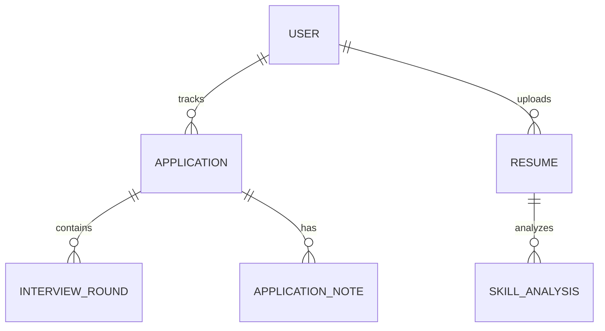

# Database Design Schema & Normalization

This document details the database schema, relational structure, normalization steps, and indexing strategy for the Internship & Placement Intelligence Platform.

---

## 1. Relational Database Selection: PostgreSQL
We utilize **PostgreSQL** (interfaced through the Prisma ORM) for the following reasons:
1. **ACID Compliance**: Crucial for tracking application progress, offer signatures, and user authentications securely.
2. **Complex Queries**: Required to generate multidimensional analytics dashboard statistics (e.g. nested round metrics, weekly performance).
3. **Structured Schemas**: Prevent data pollution by enforcing type safety at the storage level.

---

## 2. Conceptual Schema Outline
We will structure the schema into normalized tables. Below is the conceptual entity relationships:

### Proposed Entities

#### 1. `users`
Tracks system credentials and role permissions.
* `id` (UUID, Primary Key)
* `name` (VARCHAR, Not Null)
* `email` (VARCHAR, Unique, Not Null)
* `password` (VARCHAR, Not Null - Hashed using bcrypt)
* `role` (ENUM: `STUDENT`, `ADMIN`, Default: `STUDENT`)
* `createdAt` (Timestamp)
* `updatedAt` (Timestamp)

#### 2. `applications`
Stores internship or placement tracking details.
* `id` (UUID, Primary Key)
* `userId` (UUID, Foreign Key referencing `users(id)`)
* `companyName` (VARCHAR, Not Null)
* `roleTitle` (VARCHAR, Not Null)
* `jobUrl` (VARCHAR, Nullable)
* `salary` (DECIMAL, Nullable)
* `location` (VARCHAR, Nullable)
* `domain` (ENUM/VARCHAR, SWE, DevOps, PM, etc.)
* `status` (ENUM: `APPLIED`, `OA_SCHEDULED`, `OA_COMPLETED`, `INTERVIEWING`, `OFFER`, `REJECTED`, `WITHDRAWN`)
* `deadline` (Timestamp, Nullable)
* `appliedDate` (Timestamp, Not Null)
* `createdAt` (Timestamp)
* `updatedAt` (Timestamp)

#### 3. `interview_rounds`
Enables multiple nested rounds of interview steps per application.
* `id` (UUID, Primary Key)
* `applicationId` (UUID, Foreign Key referencing `applications(id)`)
* `roundName` (VARCHAR, e.g., Technical 1, System Design, HR)
* `scheduledAt` (Timestamp, Nullable)
* `interviewerName` (VARCHAR, Nullable)
* `rating` (INT, Rating from 1 to 5)
* `notes` (TEXT, Interview questions or comments)
* `createdAt` (Timestamp)
* `updatedAt` (Timestamp)

#### 4. `resumes`
Tracks resume uploads per student.
* `id` (UUID, Primary Key)
* `userId` (UUID, Foreign Key referencing `users(id)`)
* `fileName` (VARCHAR)
* `fileUrl` (VARCHAR) -- AWS S3 URL
* `createdAt` (Timestamp)

#### 5. `skill_analyses`
Stores AI-driven skill comparisons and learning roadmaps.
* `id` (UUID, Primary Key)
* `resumeId` (UUID, Foreign Key referencing `resumes(id)`)
* `jobDescriptionText` (TEXT)
* `matchScore` (INT, Range 0-100)
* `matchedSkills` (JSON/VARCHAR[])
* `missingSkills` (JSON/VARCHAR[])
* `roadmapSteps` (JSON) -- Structured roadmap guides
* `createdAt` (Timestamp)

---

## 3. Normalization Review
The proposed schema is normalized to **Third Normal Form (3NF)**:
* **First Normal Form (1NF)**: Every cell contains only atomic values. There are no repeating groups. Arrays (like skills) can be stored in JSON/relation tables depending on query requirements.
* **Second Normal Form (2NF)**: All non-key attributes are fully functionally dependent on the primary key (no partial dependencies on composite keys).
* **Third Normal Form (3NF)**: No transitive dependencies exist. For example, company details like name are stored per application record. (If company profiles become heavy, we will extract them into a separate `companies` lookup table to keep application records slim, removing transitive redundancy. We will analyze this choice in Phase 3).

---

## 4. Indexing & Optimization Strategy
To ensure fast load times, we will implement the following indexes during database generation:
* **Composite Index** on `(userId, status)` inside `applications` to accelerate filtering on dashboard queries.
* **Foreign Key Indexes**: Postgres does not automatically index foreign keys. We will index `applications(userId)`, `interview_rounds(applicationId)`, and `skill_analyses(resumeId)` to speed up join operations.
